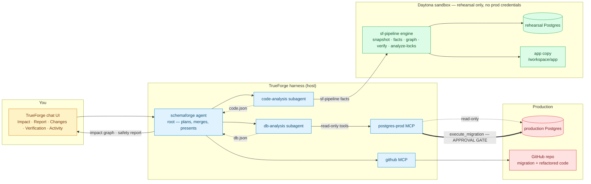
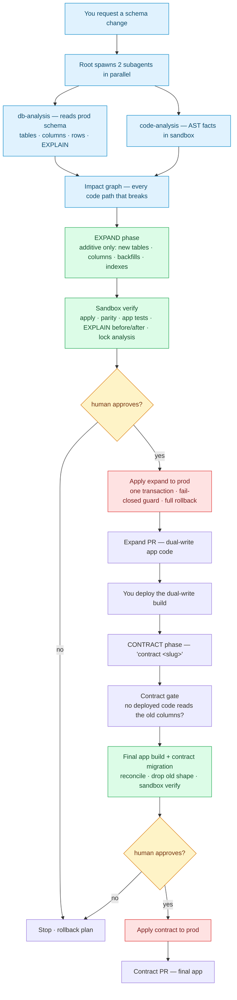

# SchemaForge demo script (3:00)

Verified against the live Task-12 run (2026-08-27, session `01m120emd…`):
prod 200k users split into `users` + `user_profiles`, approval gate fired,
PR #15 opened, Qodo reviewed it clean. Timings below are from that run —
the demo video is an **edited** recording of a fresh run (see Production
notes); only the approval click is shown real-time.

---

## 1. The problem — why schema changes are dangerous

A production schema change is a cross-cutting bomb.

- **You cannot see the blast radius.** One `ALTER TABLE` touches the
  database, every ORM model, every query, and every API endpoint that reads
  the changed columns. Which code paths break if you drop a column? Nobody
  knows until the pager goes off — grep does not understand the schema, and
  asking an LLM to "find everything that uses this column" is a guess.
- **Locks are outages.** `DROP COLUMN`, `SET NOT NULL`, and type changes
  take an `AccessExclusive` lock: reads *and* writes to that table stall
  until the DDL finishes. On a big table that is minutes of frozen traffic;
  on a hot table it is a public incident.
- **Data does not forgive.** Backfills can duplicate or silently drop
  rows. DDL has no undo. A mid-migration failure can leave the database
  half-migrated with no clean rollback — and the "fix" is another risky
  `ALTER`.
- **Humans apply raw SQL by hand.** No impact analysis, no rehearsal, no
  parity check. One typo in production is expensive, and the standard
  response — "just run it and watch" — is the risk.
- **The app never gets to prove itself.** Code is tested against one
  schema and deployed against another. Tests pass, production breaks.

Net effect: the riskiest moment in a product's life is a routine migration,
and the industry treats it as a manual, high-ceremony ritual.

## 2. The solution — SchemaForge

SchemaForge is an autonomous, AST-aware, zero-downtime database migration &
refactoring agent built on TrueForge. It inverts the usual approach: the
LLM plans, orchestrates, and explains — but it never parses the codebase. A
deterministic engine computes the facts.

**Deterministic impact analysis.** `sf-pipeline` introspects the real
database (`information_schema`: tables, columns, indexes, foreign keys, row
counts) and parses the real application source (Python AST / SQLAlchemy, or
TypeScript / Drizzle) into one impact graph: *table → model → attribute →
endpoint*, plus raw-SQL edges. The answer to "what breaks if I change this
column" is computed, not guessed.

**Proof before approval, in an isolated sandbox.** The app and a Postgres
replica are provisioned in a Daytona sandbox — no credentials, no
production access. The migration is applied there, data parity is checked,
the application's own tests run, `EXPLAIN ANALYZE` is measured before/after,
and every statement gets a lock analysis. The safety report carries numbers
that came out of tools, not out of the model.

**Two-phase, zero-downtime workflow.** Every migration is split into an
additive **EXPAND** phase — new tables, new columns, backfills, indexes:
safe under live traffic — and a gated **CONTRACT** phase that removes the
old shape. In between, the application runs a dual-write build. The contract
phase is only unlocked by a deterministic gate proving that no deployed code
reads the columns being removed.

**One human approval gate.** The only write path to production is a single
MCP tool (`execute_migration`), annotated destructive and paused by the
harness until a human clicks approve. The server-side guard fail-closes
before any statement executes: per-phase verb allowlists, backfill UPDATEs
may only touch columns the batch itself added, and the whole migration runs
in one transaction — any failure rolls everything back.

**Delivery through the normal code flow.** The migration plus the
refactored application code go up as a GitHub PR (Qodo-reviewed), so the
change is peer-reviewed and reversible before it is ever merged.

## 3. Architecture — how everything fits together



## 4. The flow — from request to safe apply



## 5. The 3:00 demo beats

The beats below are from the recorded single-migration run; the full
two-phase expand → deploy → contract story is sections 1–4 (the flow
diagram shows both gates). The approval-click moment is identical in both —
that is the money shot.

### 0:00–0:20 — Hook
"Every schema change in production is a gamble: you don't know which code
paths break, how long the lock lasts, or whether data survives. SchemaForge
removes the gamble — it proves the migration safe before you approve it."

### 0:20–0:50 — Setup shot
Show: TrueForge chat, the `schemaforge` agent selected, the agent library.
One sentence:
"Two real tools via MCP — our production Postgres and GitHub — plus a
Daytona sandbox. The only prod write path is one approval-gated tool."
Overlay the agent card: model `cloudflare/deepseek-v4-flash`, postgres-prod
preloaded, github deferred, sandbox on, iteration_limit 100.

### 0:50–1:20 — The request + subagents
Send the locked prompt:
> "Split the users table into users and user_profiles. user_profiles gets
> id, user_id (1:1 FK), address, date_of_birth. users keeps id, name,
> email. The API response shape of /users must not change."

Zoom in on: **two subagents spawn in parallel** (db-analysis drives the
postgres-prod MCP; code-analysis runs the AST engine in the sandbox). Tool
calls scroll: `list_tables`, `table_schema` ×3, `row_count` (1 / 5,000 /
**200,000**), `EXPLAIN` ×3, `sf-pipeline facts`.

### 1:20–1:50 — Impact graph
Show the mermaid graph (**26 nodes, 43 edges**): table → model → attr →
endpoint, plus the raw-SQL edges.
"This is the answer to 'what breaks if I change this column' — computed
deterministically by the engine, not by asking the model to grep."

### 1:50–2:25 — Sandbox proof
Code Mode runs in the Daytona sandbox: `alembic upgrade`, data-parity
checks, `pytest` (6 contract tests), `EXPLAIN ANALYZE` before/after.
The safety report card: **migration PASS / tests PASS / parity PASS**,
200,000 rows preserved 1:1, DDL wall time **1,052 ms on 100k rows**,
rollback = `alembic downgrade -1` (guarded: blocked if any user lacks a
profile row).

### 2:25–2:50 — THE GATE
"Apply to production?" — the chat **PAUSES**. The `execute_migration`
call is waiting on human approval. Click **APPROVE**.
"applied 5 migration statement(s) in one transaction" → the agent verifies:
`user_profiles` = 200,000 = `users`, FK + unique constraint confirmed via
`table_schema`.
Then: "and it opens the PR for you" — show PR #15: the 0002 migration +
models/routers diff, reviewable, Qodo-checked.

### 2:50–3:00 — Close
"Built on TrueForge: real MCP tools, sandbox code execution, parallel
subagents, a native approval gate, and a session that survived a server
restart. Qodo reviewed every PR — evidence in the README."

---

## 6. Production notes (record + edit)

1. **Reset prod before the take** (pre-split baseline):
   ```bash
   docker compose -f demo-app/prod-postgres/docker-compose.yml down -v
   docker compose -f demo-app/prod-postgres/docker-compose.yml up -d
   bash demo-app/seed_prod.sh          # alembic 0001 + 200k users / 5k books
   ```
2. **Start the services**: `bash scripts/run_mcp_servers.sh` (postgres-mcp
   :8001, github-mcp :8002), TrueForge on `[::1]:8790`. Confirm agent
   `schemaforge` is registered (`scripts/apply_agent.py` is idempotent).
3. **Record**: full chat UI (browser) + a terminal showing the MCP servers
   (tool traffic). 1080p. Mic optional. One take; edit to the beats above.
4. **The run takes ~15–20 min wall** (live run: sandbox boot + analysis
   ~8 min, authoring + verify ~5 min, apply + PR ~2 min). Edit down: keep
   the subagent spawn, the graph, the report card, and the approval click
   real-time; fast-forward or cut the sandbox install.
5. **If the model pauses at `ask_user_question`** before the tool call
   (as in the live run): answer it on screen ("Approve"), then the
   `execute_migration` approval card appears — that click is the money shot.
6. **429 rate-limit risk** (Cloudflare Workers AI): if a turn dies with
   "Request failed (429)", wait ~5 min and resume in the same session —
   the session continuity beat is part of the demo's story.
7. **After the take**: prod is post-split; reset it again before the next
   take (step 1) — the demo always starts from a pre-split prod.